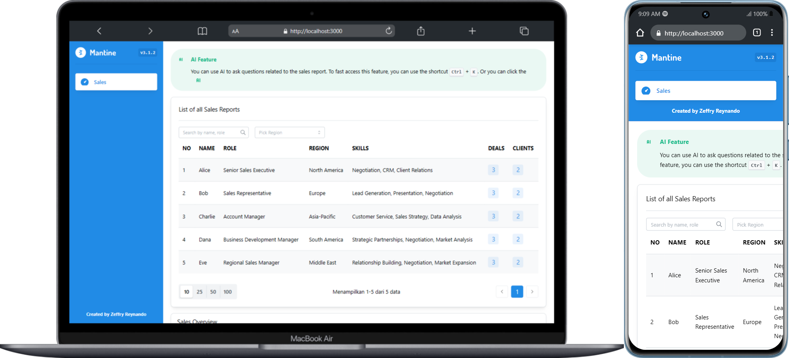
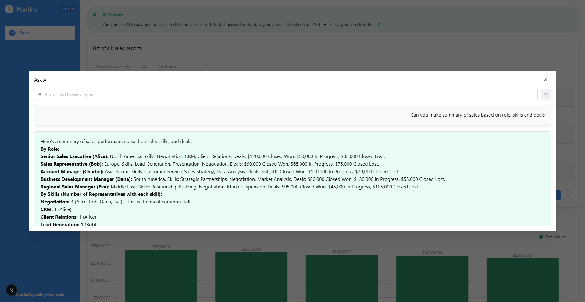

# Boardles (Dashboard Sales)



This repository contains two projects:
- Frontend: Built with NextJS
- Backend: Built with FastAPI

## Getting Started

Follow these instructions to set up the project on your local machine.

### Prerequisites

- Git
- Node.js and npm
- Python 3.8+ and pip

## Installation

### 1. Clone the Repository

```bash
git clone https://github.com/zgramming/coding-test-inter-opera.git
cd coding-test-inter-opera
```

### 2. Frontend Setup

Navigate to the frontend directory and install dependencies:

```bash
cd frontend
npm i
```

### 3. Backend Setup

Navigate to the backend directory and install dependencies:

```bash
cd backend
pip install -r requirements.txt
```

### 4. Environment Configuration

Create a `.env` file in the backend directory:

```bash
cd backend
touch .env 
```

Add the following environment variables to the `.env` file:

```
# Database Configuration
GEMINI_API_KEY=YOUR_GEMINI_API_KEY
```

## Running the Application

### 1. Start the Backend Server

From the project root directory:

```bash
cd backend
fastapi dev .\main.py
```

The API will be available at `http://127.0.0.1:8000`.

### 2. Start the Frontend Development Server

Open a new terminal and navigate to the frontend directory:

```bash
cd frontend
npm run dev
```

The frontend will be available at `http://localhost:3000`.

## Tech Stack

### Frontend
- **Framework**: Next.js (React)
- **Styling**: Tailwind CSS
- **API Client**: Axios, React Query
- **UI Components**: Mantine

### Backend
- **Framework**: FastAPI
- **Documentation**: Swagger / ReDoc

## Features

- **Data Management**
  - Data filtering and pagination
  - Search functionality
  
- **User Interface**
  - Sales Report
  - Summary chart based on sales, regional and industry
  - Ask AI
  
- **API**
  - RESTful endpoints
  - Swagger documentation

## Screenshots

### Home Page


### Ask AI


## Demo Video

https://github.com/user-attachments/assets/4e44b997-15d9-44f9-a96b-3e4bf4de9704

## Roadmap
- [ ] Light & Dark Mode
- [ ] Return stream from AI response instead of text
- [x] Mobile responsive design improvements
- [x] Mapping response AI. Convert markdown into html

## API Documentation

Once the backend server is running, you can access the API documentation at:
- Swagger UI: `http://localhost:8000/docs`
- ReDoc: `http://localhost:8000/redoc`

## License

[MIT](https://choosealicense.com/licenses/mit/)

## Contact

- Email : zeffry.reynando@gmail.com
- Linkedin : https://www.linkedin.com/in/zeffry-reynando
